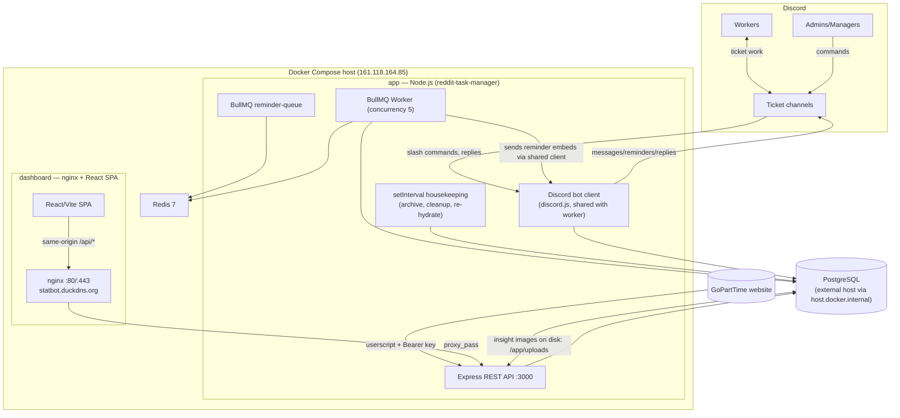

# ARCHITECTURE.md — System Architecture

> Source of truth: the repository. Verified against `src/`, `dashboard/`, `docker-compose.yml`, and configs on 2026-08-11.

---

## 1. System Overview

**Reddit Task Manager** coordinates a small team workflow: admins create/manage Reddit posting tasks, workers execute them in Discord ticket channels, and the system enforces deadlines (insight reminders), records completion, computes weekly payments and referral commissions, and exposes an admin dashboard over the web.

The system is a **single Node.js process** (bot + REST API + BullMQ worker + in-process timers), a **separate React dashboard process** (nginx), a **PostgreSQL** database, and a **Redis** broker. The only external interactions are Discord (gateway + REST), GoPartTime (inbound HTTP from the userscript), Reddit (URL validation only; no outbound API calls in the active code path), and the browser userscript.



---

## 2. Component Inventory

### 2.1 Backend (`src/`) — single Node process

| Component | Files | Responsibility | Inputs | Outputs | Depends on |
|---|---|---|---|---|---|
| Boot orchestrator | `src/index.ts` | 6-step startup, timers, graceful shutdown | env | — | everything |
| Discord client | `src/bot/index.ts` | discord.js client (intents: Guilds, GuildMessages, MessageContent, GuildMembers; partials Message/Channel) | gateway events | slash replies, messages | `env.DISCORD_TOKEN` |
| Bot events | `src/bot/events/interactionCreate.ts`, `messageCreate.ts` | command dispatch; instruction replies (URL submission); insight uploads | interactions/messages | DB writes, embeds, reactions | repositories, services |
| Commands | `src/bot/commands/*.ts` (12) | slash command implementations | interaction args | embeds, DB writes, job scheduling | services, scheduler |
| API | `src/api/server.ts` + middleware + 14 route files | REST API `/api/v1` | HTTP | JSON/CSV/files | services, schemas |
| Scheduler | `src/scheduler/{queue,jobs,worker}.ts` | BullMQ queue/worker for reminders | Redis, DB | reminder embeds, status transitions, overdue alerts | shared Discord client |
| Services | `src/services/*.ts` (11) | business logic (task, reminder, payout, commission, goparttime, analytics, audit, settings, owner-earnings, insight-storage, state-machine) | repositories | DB writes, audits, jobs | repositories, utils |
| Repositories | `src/database/repositories/*.ts` (7) | data access (Prisma queries) | services | Prisma results | Prisma client |
| DB bootstrap | `src/database/db.ts` | PrismaClient + PrismaPg adapter | `DATABASE_URL` | client singleton | generated client |
| Utils | `src/utils/*.ts` | validation, formatting, image processing, chunking, logging, permissions | — | — | — |

### 2.2 Dashboard (`dashboard/`)

| Component | Files | Responsibility |
|---|---|---|
| SPA | `dashboard/src/` | React admin UI (13 routes), PWA |
| API client | `dashboard/src/api/client.ts` | axios wrapper (all endpoints) |
| nginx | `dashboard/nginx.conf`, `Dockerfile` | TLS termination, `/api/` → `app:3000`, SPA fallback |

### 2.3 External

| System | Role |
|---|---|
| Discord | chat platform; ticket channels = task channels; bot posts reminders; workers reply |
| GoPartTime | task source; userscript runs in the browser and POSTs to the API |
| Reddit | task target; only used to validate submitted URLs (patterns in `src/utils/validators.ts`); deletion auto-detection removed |
| PostgreSQL | persistence |
| Redis | BullMQ broker (reminders) |

---

## 3. Communication Between Components

### 3.1 Request/response flows

1. **Dashboard** → nginx (same-origin `/api/*`) → `proxy_pass http://app:3000` → Express. JWT in `Authorization: Bearer`.
2. **GoPartTime userscript** → `https://statbot.duckdns.org/api/v1/goparttime/*` → Express with `Authorization: Bearer <GOPARTTIME_API_KEY>` (timing-safe compare).
3. **Discord** → bot via gateway (intents listed above). Bot → Discord via REST/gateway send.

### 3.2 Background/event-driven

- **BullMQ**: `scheduleReminderJob()` adds delayed job `reminder-{id}` (delay = `dueAt − now`); retry jobs `retry-{id}-{n}` (+2h/+6h). Worker (concurrency 5) fetches task+reminder, sends the embed **through the shared Discord client**, marks sent/completed, advances the state machine. Failures rethrow → BullMQ retries (3 attempts, 5s exponential backoff).
- **In-process timers** (see `docs/BACKGROUND_JOBS.md`): auto-archive (24h), Sunday archive (weekly), insight-image cleanup (60min, 60h TTL), reminder re-hydration (30min).

### 3.3 Repo notes

- **One Discord client shared** between bot and worker (`createBotClient()` → `initializeWorker(discordClient)`), so reminders reuse the bot's gateway connection.
- **No WebSocket** in the backend; nginx config includes upgrade headers (inherited boilerplate).
- **No cron** anywhere.

---

## 4. Data Layer Architecture

- Prisma 7 client generated into `src/generated/prisma` (gitignored; generated by Docker build or `npx prisma generate`).
- Runtime uses `PrismaPg` driver adapter (PostgreSQL), `env.DATABASE_URL`.
- `src/database/converters.ts` maps Prisma rows → domain types in `src/types/index.ts` (JSONB arrays cast, string enums narrowed).
- Repositories are thin; heavy logic lives in services. `src/database/repositories/types.ts` aliases `Prisma.TransactionClient`.
- Migrations: single idempotent SQL file applied manually (see `docs/DATABASE.md`).

---

## 5. Service Boundaries

| Service | Owns | Must NOT do |
|---|---|---|
| `task.service` | Task CRUD, status transitions, archive/restore | — |
| `state-machine` | Transition legality table (pure) | side effects |
| `reminder.service` | Reminder CRUD, scheduling timing, job-id bookkeeping | sending (worker does it) |
| `goparttime.service` | External payload validation, assignment, delivery, submission, activation | — |
| `payout.service` | Weekly windows, eligible tasks, batches, items | commissions (separate) |
| `commission.service` | Referral CRUD + commission math + batches + rates | — |
| `owner-earnings.service` | Hardcoded revenue/cost model; estimates | — |
| `analytics.service` | Stats (in-memory over `taskService.findAll`) | — |
| `audit.service` | Audit rows (non-fatal by design) | — |
| `settings.service` | Payout/commission rate rows | — |
| `insight-storage.service` | Download+saves screenshots, 60h cleanup | — |

Cross-cutting helpers: `src/utils/permissions.ts` (admin/manager IDs), `src/utils/logger.ts` (winston; file transports only in non-production), `src/utils/id-generator.ts`.

---

## 6. Key Cross-Cutting Flows

### 6.1 Worker reply to reminder (messageCreate)
```
messageCreate → handleInsightUpload
→ skip bots; require attachment (png/jpg/jpeg/webp) + reply to a message whose id == some reminder.reminderMessageId
→ guard: author == task.assignedUserId; reminder not already completed
→ reminderService.markCompleted + state advance (+ COMPLETED if shouldComplete)
→ insightStorageService.save (non-fatal on failure) + updateInsightImage
→ react ✅ / reply "✅ Insight received successfully."
```

### 6.2 GoPartTime worker URL submission (messageCreate)
```
reply to the instruction delivery message → taskRepository.findByDeliveryMessageId(channelId, repliedToId)
→ guard author/source/status/assignmentStatus → extract exactly one valid Reddit URL
→ goparttimeService.recordSubmission (latest-wins replacement) → react ✅
→ manager activates via dashboard (POST /tasks/:id/done) → reminders scheduled
```

### 6.3 Payout
```
dashboard (JWT+admin) → payoutService.{payWorker|payAll}
→ eligible = COMPLETED/ARCHIVED, not already paid (paidTaskIds), cancelledReason null, completion-time in IST week window
→ PayoutBatch (payWorker: reuse-or-create per week; payAll: always new batch, paidAt=now)
→ per task: PayoutItem + COMPLETED→ARCHIVED
```

### 6.4 Commissions
```
/commissions/pay-* → per non-closed referral: payable = one_time (if unpaid + threshold) + per_task (special inviters, dedup on existing items)
→ CommissionBatch (always new, paidAt=now) + CommissionItem rows + referral status flags
```

---

## 7. Deployment Architecture

See `docs/DEPLOYMENT.md` for details:

```
Docker Compose (bridge network app-network)
├── app        backend (Node 20-alpine), env_file .env, volume insight-uploads:/app/uploads
├── redis      redis:7-alpine (no persistence: --save ""; maxmemory 128mb allkeys-lru)
└── dashboard  nginx:stable-alpine — 80/443 public, letsencrypt webroot, proxies /api → app:3000
PostgreSQL     external (host.docker.internal, host-gateway extra-host)
Domain         statbot.duckdns.org (DuckDNS) → 161.118.164.85; letsencrypt in /etc/letsencrypt
PM2 path      ecosystem.config.js (non-Docker alternative)
```

---

## 8. Important Conventions

- **Week boundary** is IST (UTC+5:30), Sunday 00:00 → Saturday 23:59:59.999 (`IST_OFFSET_MS = 5.5h` shift trick in payout/commission/owner-earnings services).
- **IDs**: `TSK-`, `REM-`, `LOG-`, `PB-`, `PI-`, `REF-`, `CI-` prefixes (8-char uppercase nanoid); GoPartTime tasks use display IDs `Post #<id>`/`Comment #<id>`.
- **All reminder deadlines** derive from task `createdAt` via `REMINDER_DELAYS`; retries add `RETRY_DELAYS` (2h/6h).
- **Enum discipline**: `src/types/index.ts` mirrors Prisma enums plus `AssignmentStatus`, `DeliveryMessageKind`; converters cast.
- **API envelope**: `{ success: boolean, data?: …, message?: string, errors?: string[] }`.
- **Money unit**: ₹ (INR), stored as `Float` (DOUBLE PRECISION).