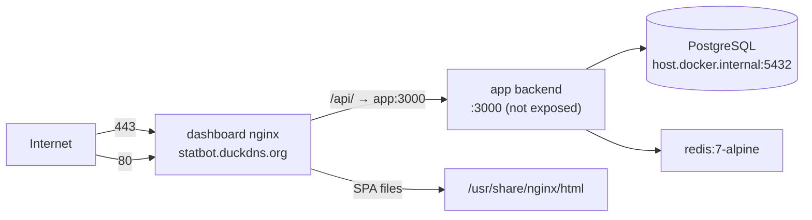

# DEPLOYMENT.md — Deployment & Infrastructure

> Verified against `Dockerfile`, `docker-compose.yml`, `dashboard/Dockerfile`, `dashboard/nginx.conf`, `ecosystem.config.js`, `prisma.config.ts` on 2026-08-11. No secrets/values documented. **Deployment status last verified: 2026-10-02 - Dashboard header/avatar cleanup live at git HEAD `a2ed9d2` (dashboard-only rebuild, no migration; backup `rtm-backup-20261002-cleanup.tar.gz`; 3 services Up, health healthy, new Dashboard chunk verified without the removed text).** Previous: 2026-10-02 - Admin dashboard premium redesign live at git HEAD `bafeede` (dashboard-only rebuild, no migration; backup `rtm-backup-20261002-redesign.tar.gz`; 3 services Up, health healthy (DB+Redis), root + all three userscripts 200, userscript still v1.6.0 byte-identical, new CSS tokens live, no Tampermonkey update needed).** Previous: 2026-10-02 - Video task delivery live at git HEAD `fbc21a1` (app + dashboard rebuild, the dashboard because it serves the userscripts; backup `rtm-backup-20261002-140810-prevideodelivery.tar.gz`; **no DB migration**; 3 services Up, health healthy (DB+Redis), boot "All systems online!" + the new `ffmpeg available` line, **ffmpeg 8.0.1 with libx264 in the running container**, `sendMedia` present / `sendImage` absent in the live `dist`, served `goparttime-send.user.js` at **1.6.0** and **byte-identical to `scripts/`** via `cmp`, live end-to-end fetch of the real clip from task #1175361 through the shipped code inside the container (6,410,028 bytes, byte-identical passthrough, `ftyp`/mp4, 504 ms), 54 suites / 758 tests; **requires a Tampermonkey update on the manager devices - extraction is browser-side and an old script still sends nothing for a video task**). **Before this deploy ffmpeg availability was verified on the exact target** - the host is **aarch64** and the image is **Alpine 3.23.4**, so `ffmpeg` (community repo, aarch64) was checked and `apk add` + `ffmpeg -version` were run in a throwaway `node:20-alpine` container before bundling; an x86-only check would have been worthless. Previous: 2026-10-02 - Submit Link autofill live at `9b72df8`; 2026-10-01 - in-ticket approver notice + `add to daily outreach` button. Read section 5 before bundling: **`origin/main` must be fetched first or the bundle can roll production back.** Previous: 2026-09-28 - Reddit profile check in new tickets live at git HEAD `0ca983ebd` (feature `2ad254c`; app-only rebuild; DB migration applied - 6 columns on `TicketOnboarding`; verified: 3 services Up, health healthy (DB+Redis), boot "All systems online!", Discord serving 1 guild, 0 of 349 existing tickets enrolled). Previous: 2026-09-27 - phase 3 never-miss scan fix + settle-based reporting live at git HEAD `bbfd6e5`.

---

## 1. Overview

Docker Compose on a Linux host at IP `161.118.164.85`, public domain **statbot.duckdns.org** (DuckDNS) with LetsEncrypt TLS. **Hosting provider: Oracle Cloud** (ARM `aarch64`, hostname `rtm-bot`, Ubuntu 24.04 with Oracle kernel, verified via SSH 2026-08-12). SSH: user `ubuntu`, key-based (key pasted by the owner during deploys; also present in repo root as gitignored `ssh-key-2026-07-19.key`).



## 2. Services (`docker-compose.yml`)

| Service | Image/Build | Ports | Volumes | Notes |
|---|---|---|---|---|
| `app` | root `Dockerfile` (node:20-alpine, 2-stage) | none exposed | `insight-uploads:/app/uploads` | `env_file: .env`; `extra_hosts: host.docker.internal:host-gateway`; `depends_on: redis` |
| `redis` | `redis:7-alpine` | none | `redis-data:/data` | `redis-server --save "" --maxmemory 128mb --maxmemory-policy allkeys-lru` (no persistence; BullMQ only) |
| `dashboard` | `./dashboard/Dockerfile` (nginx:stable-alpine) | `80:80`, `443:443` | `/etc/letsencrypt:ro`, `/var/www/letsencrypt:ro` | `depends_on: app` |

Network: single bridge `app-network`. **No healthchecks** anywhere (the app exposes `GET /api/v1/health` but nothing polls it).

## 3. Reverse Proxy (nginx, `dashboard/nginx.conf`)

- Port 80: ACME webroot (`/.well-known/acme-challenge/` from `/var/www/letsencrypt`), everything else → 301 https.
- Port 443 (`statbot.duckdns.org`): TLS 1.2/1.3, certs `/etc/letsencrypt/live/statbot.duckdns.org/`, gzip.
- `/api/` → `proxy_pass http://app:3000` with `resolver 127.0.0.11` (Docker DNS) + Host/X-Real-IP/X-Forwarded headers + HTTP/1.1 upgrade headers (WS-ready boilerplate).
- SPA: `try_files $uri $uri/ /index.html`; index.html `no-store`; `/assets/` immutable 1y.
- Headers: X-Frame-Options SAMEORIGIN, nosniff, XSS-protection.

## 4. Database Deployment

- **PostgreSQL runs outside Compose** on the host (not provisioned by any compose service); backend reaches it via `host.docker.internal` (`extra_hosts` host-gateway). Version: **PostgreSQL 16.14** (verified via psql on the host). Host client `psql` 16.14 is installed; `DATABASE_URL` in `.env` points at `host.docker.internal` — when running psql directly on the host, substitute `localhost`.
- Schema applied **manually** from `prisma/migrations/migration.sql` (idempotent; safe to re-run). No auto-migrate in any pipeline. Verify drift with: `psql "$(sed -n 's/^DATABASE_URL=//p' .env | tr -d '"' | sed 's/host.docker.internal/localhost/')" -tAc "SELECT ..."` (do not print the URL).
- **⚠️ Migration re-run safety (2026-08-12 incident):** `migration.sql` must contain **only additive schema statements** (`ADD COLUMN IF NOT EXISTS`, `ADD VALUE IF NOT EXISTS`, indexes). It previously contained a one-time data backfill (`UPDATE Task SET status='ACCEPTED' WHERE source='goparttime' AND status='PENDING'` + `DELETE FROM "Reminder"`); re-running it during a deploy on 2026-08-12 reverted 48 activated tasks to ACCEPTED and wiped their reminders (recovered via `scripts/restore-accepted.ts`). The block was removed and replaced with a DANGER comment. **Before re-running the file, grep it for `UPDATE`/`DELETE` — any data statement must never be re-run; move one-time data changes to versioned one-off scripts instead.**
- Backup/restore: **no mechanism in repo** (pre-deploy safety backups are taken manually as tarballs, e.g. `/home/ubuntu/rtm-backup-YYYYMMDD-HHMMSS.tar.gz`, excluding `node_modules/`, `dist/`, `.git`).
- **Re-run mechanics (verified 2026-09-25):** only part of `migration.sql` is replay-safe. The early section (bare `CREATE TYPE`, `CREATE TABLE`, `ALTER TABLE … ADD CONSTRAINT`) has no `IF NOT EXISTS`, so re-running the file reports those as errors — this is expected and harmless *provided* `psql` is invoked **without `-v ON_ERROR_STOP=1`**, so execution continues to the end of the file. Applying the 2026-09-25 file produced 49 "already exists" errors and still created the new `WorkerPortalAccess` table. With `ON_ERROR_STOP=1` the run aborts at the first pre-existing object and later migrations never apply. Never add a data statement to this file (see the DANGER note above).

## 5. Build & Deploy Commands

### Shipping code to the server (git bundle — no GitHub credentials on host)

The host repo is `/home/ubuntu/rtm` (user `ubuntu`). It **cannot `git pull`**: the GitHub repo (`Destroyer690420/statbot`) is private and no credentials are installed on the host. Code ships from a dev machine as a git bundle:

```
git bundle create statbot-main.bundle origin/main
scp statbot-main.bundle ubuntu@161.118.164.85:/home/ubuntu/
ssh ubuntu@161.118.164.85 "cd /home/ubuntu/rtm && git fetch /home/ubuntu/statbot-main.bundle refs/remotes/origin/main:refs/remotes/origin/main && git reset --hard refs/remotes/origin/main"
```

> ⚠️ **Bundle `origin/main`, not `HEAD` — and make sure `origin/main` is current first (verified 2026-09-28).** The host tracks whatever was last bundled, **not** GitHub. On 2026-09-28 local `origin/main` was **8 commits behind** the live host (the blast/scan fixes had been deployed but never pushed), so running the command above literally would have reset production back 8 commits — a silent rollback of verified-live fixes. Run `git fetch origin main` and confirm `git log --oneline origin/main` matches your intended deploy commit **before** bundling. To ship without pushing, bundle `HEAD` and reset the host to `FETCH_HEAD` instead.

Then build/restart as below. **Always back up the working tree first** (`tar -czf /home/ubuntu/rtm-backup-$(date +%Y%m%d-%H%M%S).tar.gz --exclude=rtm/node_modules --exclude=rtm/dist --exclude=rtm/.git -C /home/ubuntu rtm`). Verify `HEAD` after the reset. `.env`, `node_modules/`, `dist/` and server scratch files are untouched by this flow. After a verified deploy, delete the bundle from the host.

### Backend image
```
docker compose build app
docker compose up -d app redis
```
`Dockerfile` steps: `npm ci` → copy tsconfig/src/prisma/prisma.config.ts → `npx prisma generate` → `npm run build` → production stage `npm ci --production` + copy `dist/`, `src/generated/prisma`, `prisma/` → `CMD ["node","dist/index.js"]`, `EXPOSE 3000`, creates `logs/`.

### Dashboard image
```
docker compose build dashboard
docker compose up -d dashboard
```
`dashboard/Dockerfile`: node:20-alpine builder `npm ci` → `npm run build` (`tsc && vite build`) → nginx:stable-alpine copies `dist/` + `nginx.conf`.

### Full stack
```
docker compose up -d --build
```

### Post-deploy verification
- **Schema-change deploys only:** confirm the new columns exist before trusting anything downstream (`psql "$DBURL" -tAc "SELECT column_name FROM information_schema.columns WHERE table_name='<Table>' AND column_name LIKE '<prefix>%'"`). The migration log will show many "already exists" errors from the non-idempotent early section; count the *unexpected* ones (`grep -i error /tmp/migrate.log | grep -vc 'already exists'` — want 0).
- **Feature-gate deploys only:** check the new code is actually in the live image (`docker compose exec -T app test -f dist/<module>.js`) and that the code you replaced is **absent** (`grep -q <oldSymbol> dist/<file>.js` should fail).
- **Anything that migrates existing rows:** verify the population you meant to protect was not touched (e.g. after the 2026-09-28 profile-check deploy: `SELECT count(*) FROM "TicketOnboarding" WHERE "profileCheckStatus" IS NOT NULL` had to be **0**, proving the ~250 pre-existing tickets were not enrolled).
- `docker compose ps` (all 3 services Up).
- `curl -fsS https://statbot.duckdns.org/api/v1/health` → `"status":"healthy"` with database+redis connected.
- Boot log walkthrough: `docker compose logs app` should show all 6 init steps ending with "All systems online!".
- Dashboard root + `/goparttime-send.user.js` return 200.
- Bot commands: `npm run deploy-commands` (idempotent; run after any `src/bot/commands/*` change).
- DB drift check: compare `prisma/schema.prisma`/`migration.sql` against the live DB (migration is idempotent; re-run only if drift found).

### Local (non-Docker) development
- Backend: `npm install && npx prisma generate && npm run build && npm start` (or `npm run dev`).
- Commands: `npm run deploy-commands`.
- Dashboard: `cd dashboard && npm install && npm run dev` (port 5173, proxy → `https://161.118.164.85`).

### One-off operator scripts (run from the host repo, not from a container)

Some maintenance jobs are Discord broadcasts or one-time data fixes, so they are versioned scripts under `scripts/` and run once by hand with `npx tsx` (the repo has `tsx` as a dev dependency; the running `app` container does not need them). They log in with the same bot token, so **run them when no blast is in flight**.

| Script | What it does | Flags |
|---|---|---|
| `scripts/ask-reddit-profile-links.ts` | One-off ask, once per existing ticket, for the worker's Reddit profile link (tags the ticket's worker). Exactly-once via `TicketOnboarding.redditProfileRequestedAt`. | `--dry-run`, `--force`, `--all-text-channels`, `--only <ids\|names>`, `--concurrency <n>` |
| `scripts/verify-profile-check-live.ts` | Exercises the real vaulted Reddit session and prints each verdict (read-only, no Discord messages). Asserts a nonexistent username is never reported as `suspended`. Run it from the host **before** relying on the profile check. | — |
| `scripts/backfill-invite-detections.ts` | Stages historical `InviteDetection` rows. | `--since YYYY-MM-DD`, `--dry-run` |
| `scripts/approve-pending-detections.ts` | Approves staged detections into `Referral` rows. | `--dry-run` |
| `scripts/restore-accepted.ts` | Recovery tool for the 2026-08-12 migration incident. | — |

Sequence for `ask-reddit-profile-links.ts` (the column must exist first, or the script exits before sending anything):

```
# 1. apply the additive migration (schema-only, idempotent)
psql "$(sed -n 's/^DATABASE_URL=//p' .env | tr -d '"' | sed 's/host.docker.internal/localhost/')" -f prisma/migrations/migration.sql

# 2. the host-side Prisma client must know the new column (the app image is unaffected)
npx prisma generate

# 3. see exactly who would be asked, send nothing
DBURL="$(sed -n 's/^DATABASE_URL=//p' .env | tr -d '"' | sed 's/host.docker.internal/localhost/')"
DATABASE_URL="$DBURL" npx tsx scripts/ask-reddit-profile-links.ts --dry-run

# 4. send for real (re-runnable: already-asked tickets are skipped)
DATABASE_URL="$DBURL" npx tsx scripts/ask-reddit-profile-links.ts
```

⚠️ **Any host-side script that reads the DB must call `initializeDatabase()` first** (learned 2026-09-28): `redditSessionService.loadCookie()` and friends swallow a DB error into `null`, so a script that skips it reports `no_session` and looks exactly like a missing vault. The app is unaffected (it initializes at boot); operator scripts are not. See `scripts/verify-profile-check-live.ts` for the correct pattern.

⚠️ **`DATABASE_URL` rewrite is required** (verified live 2026-09-27): the host `.env` points at `host.docker.internal`, which only resolves inside the compose network, so a host-side `tsx` process fails the script's preflight with `Can't reach database server at host.docker.internal`. That failure is safe (nothing is sent) but confusing — use the `DBURL` form above. No Docker rebuild is needed: nothing in the running app reads this column or message.

Notes: the sweep logs in with `Guilds` + `GuildMembers` only, resolves each ticket's worker as the single non-bot/non-staff member, skips anything ambiguous, and stamps the ticket only after Discord accepts the message (so a partial run is resumed, never repeated, by re-running). One audit row (`OUTREACH_MESSAGE_SENT`, `userId = 'reddit-profile-request'`) records the broadcast. Do not run it while a blast is open (`:10`–`:16` IST) — check `SELECT count(*) FROM "OutreachBlast" WHERE status = 'OPEN'`.

## 6. PM2 Alternative (non-Docker)

`ecosystem.config.js`: app `reddit-task-manager`, `dist/index.js`, 1 instance, `autorestart`, `max_memory_restart 500M`, `NODE_ENV: production`, logs `logs/pm2-error.log` / `logs/pm2-out.log`. Start: `pm2 start ecosystem.config.js`.

## 7. Discord Bot Deployment Notes

- Commands must be (re)deployed after edits: `npm run deploy-commands` (guild-scoped; requires `DISCORD_TOKEN`, `CLIENT_ID`, `GUILD_ID`).
- Bot must be in the guild and have permissions to send messages in ticket channels; Message Content intent must be enabled (used by reply parsing). For ticket auto-welcome on `channelCreate`, bot needs **View Audit Log** permission to fetch the creator via audit logs (falls back to member detection if denied) and **Send Messages** in ticket channels. For member join welcome on `guildMemberAdd`, bot needs **Server Members Intent** (already `GuildMembers`) and **Send Messages** in `#invites` (`1520616800063328437`).
- **In-ticket buttons need no extra Discord permission and no slash-command redeploy.** The `add to daily outreach` button (`outreach_add:*`) is a message component, so the bot only needs the same **Send Messages** it already has in ticket channels; `interactionCreate` handles it in the same process that serves commands. Editing a component in place after a click (`editReply`) needs no additional scope.

## 8. GoPartTime Extension Deployment

- Userscript served at `https://statbot.duckdns.org/goparttime-send.user.js` (from `dashboard/public/` — must stay identical to `scripts/goparttime-send.user.js`).
- Session format-check script served at `https://statbot.duckdns.org/reddit-format-check.user.js` (same mirroring rule vs `scripts/reddit-format-check.user.js`; manager-only, Tampermonkey on reddit.com).
- Workers install via Tampermonkey (desktop) or Edge Canary (Android, see `ANDROID_SETUP.md`); enter the API URL + shared `GOPARTTIME_API_KEY` once.

## 9. Insight Image Storage

Volume `insight-uploads` mounted at `/app/uploads` — screenshots live there with a 60h TTL cleanup (files deleted by the app; see `docs/INSIGHT_SYSTEM.md`). Worker payment QR codes live under the same mount at `/app/uploads/payment-qr/<workerId>.<ext>` (one current file per worker, no TTL — they persist until replaced), so they ride along with any volume-level backup of `insight-uploads` automatically. Note there is still no automated backup mechanism in repo (§4) — if the owner backs up the volume, QRs are covered; if not, a volume loss means workers re-upload (the `WorkerPaymentInfo` rows survive in Postgres, but the files do not).

## 10. Logs

- Container logs: `docker compose logs -f app` / `dashboard` / `redis`.
- winston file transports **only in non-production** (`logs/error.log`, `logs/combined.log`, 5MB rotate ×5) — production logs go to stdout → Docker.
- PM2 path: `logs/pm2-*.log`.

## 11. Restart & Rollback

- Restart: `docker compose restart app` (reminder jobs survive via re-hydration within 30 min; queue re-created at boot).
- Rollback: re-bundle an older commit with the same bundle flow (§5) + rebuild images, or restore the pre-deploy working-tree tarball (`/home/ubuntu/rtm-backup-*.tar.gz`). **No blue/green or versioned image tags in repo.**

## 12. Known Deployment Gaps

1. No healthcheck wiring (container health never verified by orchestration).
2. Redis runs without persistence — a Redis loss only costs pending delayed jobs (re-hydrated from Postgres).
3. `.env` must contain `DATABASE_URL` (missing from `.env.example`).
4. `dist/` at repo root is stale; never use it for manual deploys (`npm run build` regenerates).
5. DuckDNS domain + LetsEncrypt renewal relies on the ACME webroot mount (`/var/www/letsencrypt`) — renewal client config not in repo (UNKNOWN).
6. **Server has no GitHub credentials** (private repo) — no `git pull`; every deploy ships via git bundle from a dev machine (see §5). A read-only deploy key or PAT on the host would remove this gap.
