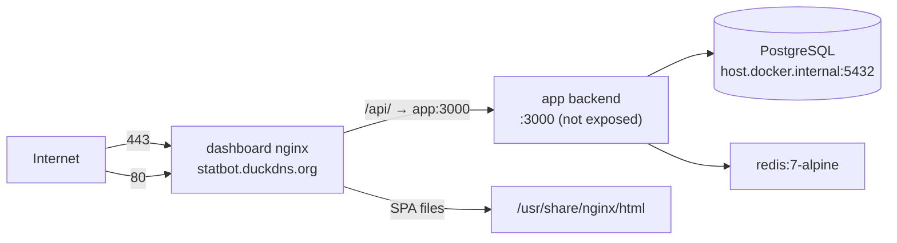

# DEPLOYMENT.md — Deployment & Infrastructure

> Verified against `Dockerfile`, `docker-compose.yml`, `dashboard/Dockerfile`, `dashboard/nginx.conf`, `ecosystem.config.js`, `prisma.config.ts` on 2026-08-11. No secrets/values documented. Deployment status last verified: UNKNOWN (nothing in the repo proves the last live deploy; compose + nginx files are the current declared architecture).

---

## 1. Overview

Docker Compose on a Linux host at IP `161.118.164.85`, public domain **statbot.duckdns.org** (DuckDNS) with LetsEncrypt TLS. **Hosting provider: UNKNOWN** (no provider reference exists in the repo; `plan.md` mentions "Ubuntu VPS" + PM2 as the historical non-Docker path; **there are no Oracle Cloud references anywhere**).



## 2. Services (`docker-compose.yml`)

| Service | Image/Build | Ports | Volumes | Notes |
|---|---|---|---|---|
| `app` | root `Dockerfile` (node:20-alpine, 2-stage) | none exposed | `insight-uploads:/app/uploads` | `env_file: .env`; `extra_hosts: host.docker.internal:host-gateway`; `depends_on: redis` |
| `redis` | `redis:7-alpine` | none | `redis-data:/data` | `redis-server --save "" --maxmemory 128mb --maxmemory-policy allkeys-lru` (no persistence; BullMQ only) |
| `dashboard` | `./dashboard/Dockerfile` (nginx:stable-alpine) | `80:80`, `443:443` | `/etc/letsencrypt:ro`, `/var/www/letsencrypt:ro` | `depends_on: app` |

Network: single bridge `app-network`. **No healthchecks** anywhere (the app exposes `GET /api/v1/health` but nothing polls it).

## 3. Reverse Proxy (nginx, `dashboard/nginx.conf`)

- Port 80: ACME webroot (`/.well-known/acme-challenge/` from `/var/www/letsencrypt`), everything else → 301 https.
- Port 443 (`statbot.duckdns.org`): TLS 1.2/1.3, certs `/etc/letsencrypt/live/statbot.duckdns.org/`, gzip.
- `/api/` → `proxy_pass http://app:3000` with `resolver 127.0.0.11` (Docker DNS) + Host/X-Real-IP/X-Forwarded headers + HTTP/1.1 upgrade headers (WS-ready boilerplate).
- SPA: `try_files $uri $uri/ /index.html`; index.html `no-store`; `/assets/` immutable 1y.
- Headers: X-Frame-Options SAMEORIGIN, nosniff, XSS-protection.

## 4. Database Deployment

- **PostgreSQL runs outside Compose** on the host (not provisioned by any compose service); backend reaches it via `host.docker.internal` (`extra_hosts` host-gateway). Version UNKNOWN.
- Schema applied **manually** from `prisma/migrations/migration.sql` (idempotent; safe to re-run). No auto-migrate in any pipeline.
- Backup/restore: **no mechanism in repo** (UNKNOWN how production backups work).

## 5. Build & Deploy Commands

### Backend image
```
docker compose build app
docker compose up -d app redis
```
`Dockerfile` steps: `npm ci` → copy tsconfig/src/prisma/prisma.config.ts → `npx prisma generate` → `npm run build` → production stage `npm ci --production` + copy `dist/`, `src/generated/prisma`, `prisma/` → `CMD ["node","dist/index.js"]`, `EXPOSE 3000`, creates `logs/`.

### Dashboard image
```
docker compose build dashboard
docker compose up -d dashboard
```
`dashboard/Dockerfile`: node:20-alpine builder `npm ci` → `npm run build` (`tsc && vite build`) → nginx:stable-alpine copies `dist/` + `nginx.conf`.

### Full stack
```
docker compose up -d --build
```

### Local (non-Docker) development
- Backend: `npm install && npx prisma generate && npm run build && npm start` (or `npm run dev`).
- Commands: `npm run deploy-commands`.
- Dashboard: `cd dashboard && npm install && npm run dev` (port 5173, proxy → `https://161.118.164.85`).

## 6. PM2 Alternative (non-Docker)

`ecosystem.config.js`: app `reddit-task-manager`, `dist/index.js`, 1 instance, `autorestart`, `max_memory_restart 500M`, `NODE_ENV: production`, logs `logs/pm2-error.log` / `logs/pm2-out.log`. Start: `pm2 start ecosystem.config.js`.

## 7. Discord Bot Deployment Notes

- Commands must be (re)deployed after edits: `npm run deploy-commands` (guild-scoped; requires `DISCORD_TOKEN`, `CLIENT_ID`, `GUILD_ID`).
- Bot must be in the guild and have permissions to send messages in ticket channels; Message Content intent must be enabled (used by reply parsing).

## 8. GoPartTime Extension Deployment

- Userscript served at `https://statbot.duckdns.org/goparttime-send.user.js` (from `dashboard/public/` — must stay identical to `scripts/goparttime-send.user.js`).
- Workers install via Tampermonkey (desktop) or Edge Canary (Android, see `ANDROID_SETUP.md`); enter the API URL + shared `GOPARTTIME_API_KEY` once.

## 9. Insight Image Storage

Volume `insight-uploads` mounted at `/app/uploads` — screenshots live there with a 30h TTL cleanup (files deleted by the app; see `docs/INSIGHT_SYSTEM.md`).

## 10. Logs

- Container logs: `docker compose logs -f app` / `dashboard` / `redis`.
- winston file transports **only in non-production** (`logs/error.log`, `logs/combined.log`, 5MB rotate ×5) — production logs go to stdout → Docker.
- PM2 path: `logs/pm2-*.log`.

## 11. Restart & Rollback

- Restart: `docker compose restart app` (reminder jobs survive via re-hydration within 30 min; queue re-created at boot).
- Rollback: `git checkout <commit>` on the host + rebuild images. **No blue/green or versioned image tags in repo.**

## 12. Known Deployment Gaps

1. No healthcheck wiring (container health never verified by orchestration).
2. Redis runs without persistence — a Redis loss only costs pending delayed jobs (re-hydrated from Postgres).
3. `.env` must contain `DATABASE_URL` (missing from `.env.example`).
4. `dist/` at repo root is stale; never use it for manual deploys (`npm run build` regenerates).
5. DuckDNS domain + LetsEncrypt renewal relies on the ACME webroot mount (`/var/www/letsencrypt`) — renewal client config not in repo (UNKNOWN).