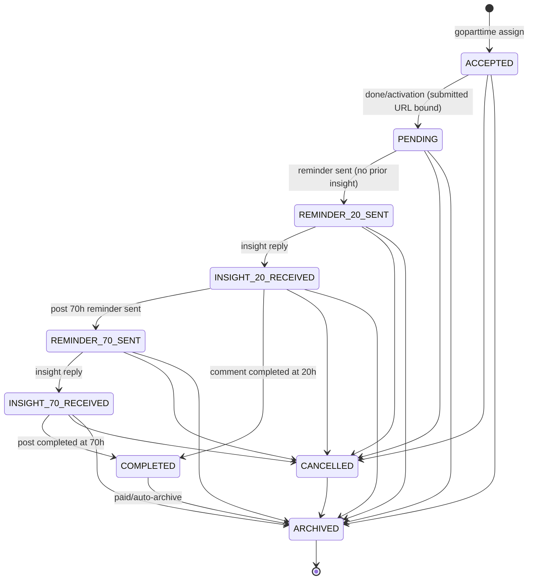

# TASK_SYSTEM.md — Task Lifecycle

> Verified against `src/services/task.service.ts`, `src/services/state-machine.ts`, `prisma/schema.prisma` on 2026-08-11.

---

## 1. Task Entity

A Task is one Reddit **post** or **comment** assigned to one worker in one Discord ticket channel.

Key fields (full list in `docs/DATABASE.md`):
- `id` — manual (`/task task_id`, uppercased, pattern `^[A-Za-z0-9 _#-]{1,32}$`) or generated `TSK-XXXXXXXX`; for GoPartTime tasks the display ID is `Post #<id>` / `Comment #<id>`.
- `redditUrl` — required for manual tasks; optional for GoPartTime (until submission).
- `type` — `POST|COMMENT`; `status`; `guildId`, `channelId` (ticket), `channelName`.
- `assignedUserId`, `assignedUserName`, `createdById`, `notes`, `cancelledReason`.
- GoPartTime delivery fields: `source='goparttime'`, `externalTaskId`, `sourceUrl`, `subreddit`, `subredditUrl`, `flair`, `title`, `postLink`, `contentHtml`, `formattedContent`, `payment`, `deadline`, `taskImages` (JSONB), `deliveryMessages` (JSONB), `assignmentStatus` (`PENDING|SENT|FAILED`), `assignmentError`, `submittedRedditUrl`, `submittedAt/By`, `reviewedAt/By` (reviewed columns currently unused by any flow beyond being stored).
- `createdAt`, `updatedAt`.

## 2. Creation Paths

| Path | Status at creation | Reminders |
|---|---|---|
| `/task` command or `POST /api/v1/tasks` | `PENDING` | created immediately (Comment: 1, Post: 2) |
| GoPartTime assign (`POST /goparttime/assign` or dashboard twin) | `ACCEPTED` + `assignmentStatus PENDING` | **none** — scheduled only after activation (`/done`) |

Validation on create (`taskService.create`):
- task ID pattern + duplicate-ID check (manual path only);
- Reddit URL must match `REDDIT_URL_PATTERN` (`https?://(www|old|new).reddit.com/...`);
- notes ≤ 500 chars;
- duplicate Reddit URL per guild rejected (`"This Reddit URL already exists."`);
- (GoPartTime path) zod schema + dedupe on `(source, externalTaskId)` (409) + one-task-awaiting-submission-per-ticket guard.

## 3. State Machine (`src/services/state-machine.ts`)

Rules:
- `transition(from, to)` throws `Invalid state transition: from → to` for illegal moves; side effects stay in callers.
- `CANCELLED → PENDING` is **not** legal — restore uses `restoreToPending` (bypasses the machine; clears `cancelledReason`).
- Helpers: `getStatusAfterReminderSent` (`PENDING→REMINDER_20_SENT`, `INSIGHT_20_RECEIVED→REMINDER_70_SENT`), `getStatusAfterInsightReceived`, `shouldComplete`, `isTerminal`, `isCancellable`.

## 4. Automatic Status Transitions (driver → destination)

| Driver | Trigger | Transition |
|---|---|---|
| BullMQ worker | reminder embed sent, first time | `PENDING→REMINDER_20_SENT` |
| BullMQ worker | post 70h reminder sent | `INSIGHT_20_RECEIVED→REMINDER_70_SENT` |
| messageCreate | insight screenshot reply | `REMINDER_20_SENT→INSIGHT_20_RECEIVED` / `REMINDER_70_SENT→INSIGHT_70_RECEIVED` (+ `→COMPLETED` via `shouldComplete`) |
| API `/done` | manager activation | `ACCEPTED→PENDING` |
| API/bot | manual | any legal transition |

## 5. Completion

- Comment: exact condition `status == INSIGHT_20_RECEIVED && type == COMMENT` → COMPLETED (single insight suffices).
- Post: `status == INSIGHT_70_RECEIVED && type == POST` → COMPLETED.
- **Overdue does not block completion** — a late insight reply still completes the task.

## 6. Overdue

- Definition: status `REMINDER_20_SENT` or `REMINDER_70_SENT` (reminder sent, response pending). No time threshold — "overdue" = sent-but-unanswered (checked by `/overdue` and stats).
- After 3 sends unanswered → admin/manager alert ping (see `docs/REMINDER_SYSTEM.md`); task stays in place.

## 7. Cancellation / Deletion

- `cancelledReason` semantics: `'deleted'` (early) or `'deleted_later'` (late) — set via dashboard dropdown (`PATCH /tasks/:id`); also `cancelTask` supports arbitrary reason (currently unused by UI).
- `cancelledReason !== null` makes the task appear "Deleted"/"Deleted Later" in embeds and skips payout eligibility and re-hydration.
- Hard delete: `DELETE /api/v1/tasks/:id` or `/delete` (admin) — only possible before payout/commission items exist (DB RESTRICT on `PayoutItem.taskId`); reminders cascade.
- Paying a task archives it: `COMPLETED → ARCHIVED` inside the payout transaction.

## 8. Archiving

| Job | Rule |
|---|---|
| Daily auto-archive (24h interval) | `COMPLETED|CANCELLED` AND `updatedAt` older than `ARCHIVE_AFTER_DAYS (30)` AND **paid** (has PayoutItem) |
| Sunday archive (weekly, UTC Sunday 00:00) | ALL paid-`COMPLETED` → `ARCHIVED` |
| Restore | `POST /tasks/restore-unpaid-archived` reverts unpaid ARCHIVED → COMPLETED |

## 9. Validation Summary (for tasks)

| Item | Rule | Where |
|---|---|---|
| Reddit URL | `REDDIT_URL_PATTERN` | `src/utils/validators.ts` |
| Task ID | `TASK_ID_PATTERN`, ≤32 chars | same |
| Notes | ≤ 500 | same |
| Duplicate URL | per-guild exact match after trim | `taskRepository.findByRedditUrl` |
| Duplicate GoPartTime | unique `(source, externalTaskId)` | schema + `findBySourceExternal` |
| One awaiting task per ticket | guard in `assignFromGoPartTime` | `findAwaitingSubmissionInChannel` |

## 10. Post vs Comment — Required Actions Summary

### Comment task
1. Create (PENDING) — manual or GoPartTime (ACCEPTED → activate).
2. Worker posts a comment on Reddit; replies the comment link (GoPartTime flow only).
3. 20h reminder → screenshot reply → `INSIGHT_20_RECEIVED` → **COMPLETED**. No 70h phase.
4. Paid → ARCHIVED.

### Post task
1. Create (PENDING) — manual or GoPartTime (ACCEPTED → activate).
2. Worker publishes the post; replies the post link (GoPartTime flow only).
3. 20h reminder → screenshot → `INSIGHT_20_RECEIVED` (not complete yet).
4. 70h reminder → screenshot → `INSIGHT_70_RECEIVED` → **COMPLETED**.
5. Paid → ARCHIVED.

All timings are `createdAt`-based (20h/70h), with 2h/6h retries — see `docs/REMINDER_SYSTEM.md`.